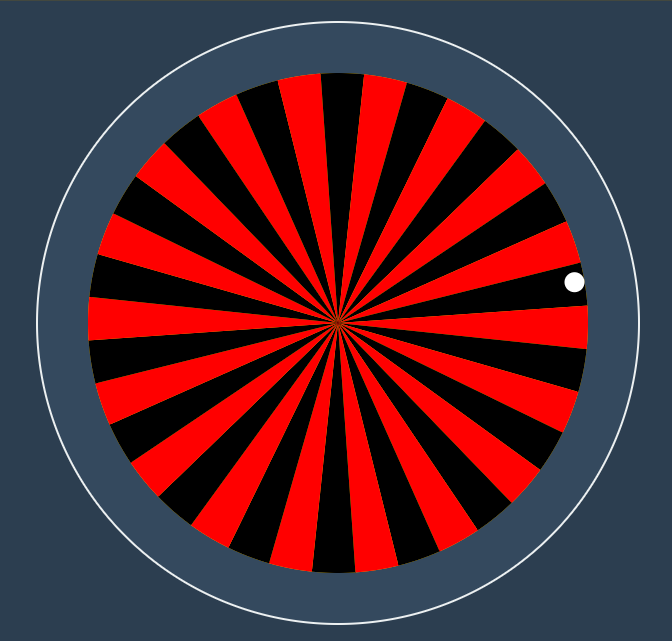
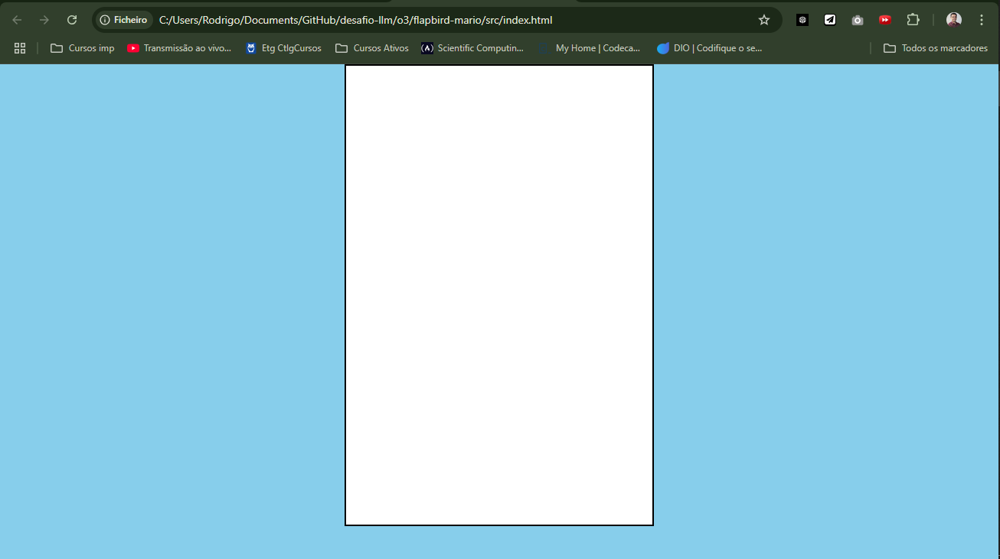
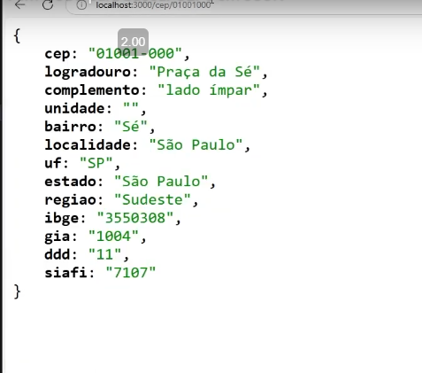

# desafio-llm
Projeto Desafio DIO - final

Nesse projeto, tem-se 3 atividades, usando o copilot e escolhendo as IAs disponiveis e verificar a performance delas:

-------------------------------------------------

1. O primeiro foi criar um jogo de roleta.

-------------------------------------------------

2. O segundo foi um jogo flapbird como o personagem mario bros.

-------------------------------------------------

3. O terceiro foi criar uma API para busca de CEP.

-------------------------------------------------